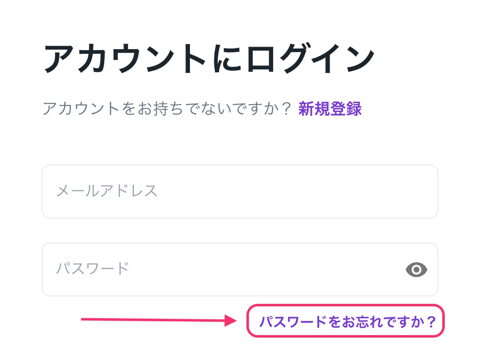

# パスワードを忘れてしまったときはどうすればいいですか？

<Tip>パスワードをお忘れの場合は、リセット画面から新しいパスワードを設定できます。</Tip>

## A. リセット画面から新しいパスワードを設定できます。

1.  ログイン画面で［パスワードをお忘れですか？］をクリックします。 

    <figure><figcaption></figcaption></figure>
2. 登録済みのメールアドレスを入力します。
3.  6桁の確認コードが届くので、確認コードと新しいパスワードを入力します。

    件名：`Reset your Uninote password`　

    送信元：`no-reply@mail.uninote.ai` 

    <figure><figcaption></figcaption></figure>

***

### 補足

* リセットメールが届かない場合は、迷惑メールフォルダをご確認ください。
* 登録済みのメールアドレスが不明な場合は、管理者にご連絡ください。

***

### 関連ページ

* [Google / Microsoft アカウントでログインした場合、パスワードは設定できますか？](https://www.notion.so/Google-Microsoft-0282eae039e4822b98fc01397a798676?pvs=21)
